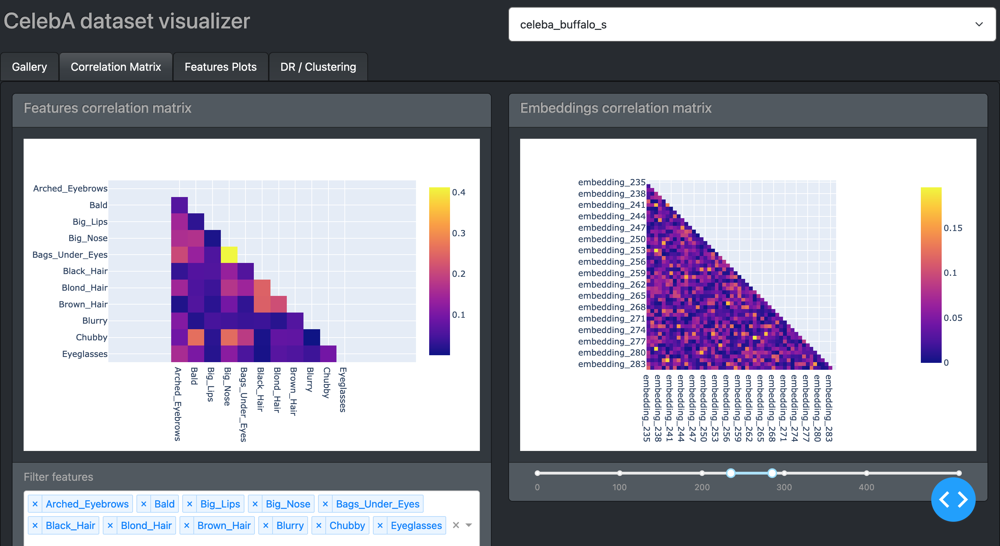
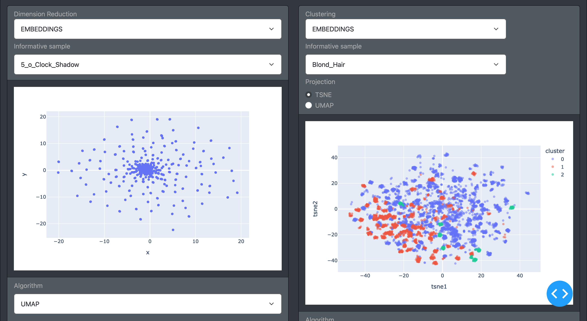
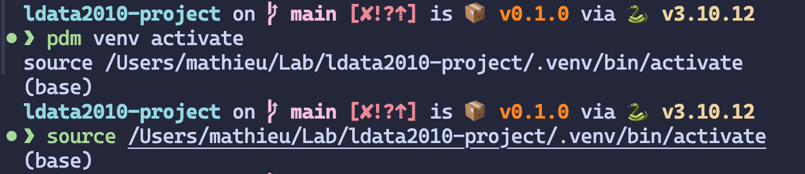

CelebA data visualization using Dash.




### Installation

#### Prerequisite

> Make sure you have at least python 3.9 installed.

> We use [pdm](https://github.com/pdm-project/pdm) as package manager for this project.

For Linux, MacOS, Windows (WSL)

```bash
curl -sSL https://pdm-project.org/install-pdm.py | python3 -
```

For Windows (PowerShell)

> Note: if you installed python through Microsoft Store, use "py" instead of "python" in the following command.

```bash
(Invoke-WebRequest -Uri https://pdm-project.org/install-pdm.py -UseBasicParsing).Content | python -
```

Other ways to install it (e.g. using pipx): https://pdm-project.org/latest/#installation

#### Create a virtual environment

You first need to create a virtual environment that will contain all the python packages necessary for running the project.

```bash
pdm venv create
pdm use .venv
```

The will create a virtual environment named `in-project` in the `.venv` folder at the root of this project.

#### Installing the packages

```bash
pdm install --no-self
```

#### Installing resources (datasets and images)

If you have the _make_ GNU utility, you can perform an **automatic** installation of the resources.

```bash
make resources
```

Alternatively, you can install the resources **manually**.

1. Download the [resources](https://shorturl.at/esBKV).
2. Create a `data` folder at the root of the project and put in there the datasets.
3. Add the `img_celeba` folder in it.

#### Activate the virtual environment

In order to run the project or any python scripts, you first need to activate the virtual environment. This will allow the python files to access the packages previously installed.
The following command will print the command you need to type in order to activate the virtual environment.

```bash
pdm venv activate in-project
```

Then type the command given to you.

Here is an example.


#### Splits and compress datasets

Then run the precomputing script that will split the datasets and compress them.

_You first need to activate the virtual environment in order to run this script. See section above._

```bash
python precompute_datasets.py
```

#### Running the project

```bash
python main.py
```

#### Troubleshooting

> Could not build wheels...

```bash
pip install --upgrade pip setuptools wheel
```
